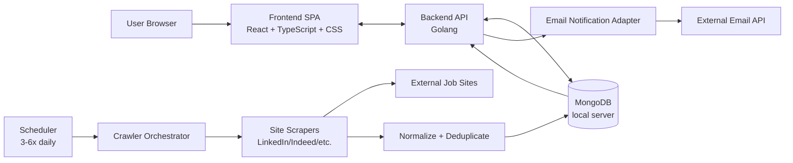
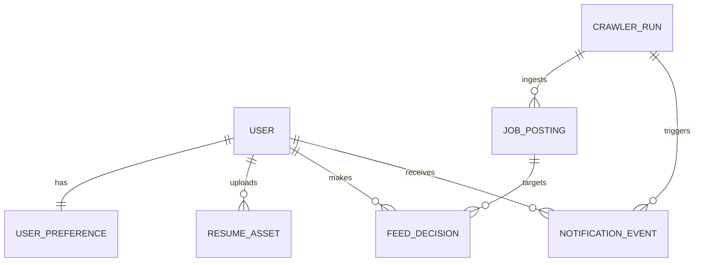

# Job Crawler Architecture

Primary source reviewed: `documents/design-document.pdf`.  
Sketches reviewed: `documents/homepage.jpg`, `documents/profiles-page.jpg`.

Current repo status: architecture is mostly **planned**; `frontend/` and `backend/` are placeholders with no implementation code yet.

## 1. System Diagram



### Data Flow (Designed)
- Scheduled crawler runs fetch postings from external sites.
- Postings are normalized/deduplicated and stored in MongoDB.
- Backend APIs return personalized feed data to the frontend.
- User actions (`apply`, `reject`, profile updates, filters) persist through backend APIs.
- Notification pipeline emails users new matching jobs based on opt-in preferences.

## 2. Key Components

### Frontend SPA
- **Purpose:** Login/signup, personalized feed, profile/preferences, application history.
- **Inputs:** User interaction + backend API payloads.
- **Outputs:** API calls for auth, feed retrieval, apply/reject, profile updates.
- **Comms:** HTTP(S) with backend only.
- **Constraints:** Clean, glanceable UX; strong filtering/sorting; fast rendering for large history lists.

### Backend API (Golang)
- **Purpose:** Business logic, auth, profile/feed endpoints, integration orchestration.
- **Inputs:** Frontend requests, crawler-ingested data.
- **Outputs:** JSON responses, DB writes, outbound notification requests.
- **Comms:** Frontend, MongoDB, email provider.
- **Constraints:** Must enforce security, maintainability, and privacy rules.

### Scheduler
- **Purpose:** Trigger crawl jobs 3-6 times daily.
- **Inputs:** Schedule config.
- **Outputs:** Crawler run events.
- **Comms:** Invokes crawler module.
- **Constraints:** Overlap/failure retry policy not yet specified.

### Crawler + Scrapers
- **Purpose:** Collect jobs from multiple sources matching user preferences.
- **Inputs:** Source pages/APIs + preference criteria.
- **Outputs:** Normalized posting records.
- **Comms:** External job sites + DB path via backend/domain layer.
- **Constraints:** Fast parsing, robust dedupe, source adapter resilience.

### MongoDB (Local)
- **Purpose:** Persist users, preferences, postings, decisions, history.
- **Inputs:** Backend/crawler writes.
- **Outputs:** Query results for feed/profile/history/notifications.
- **Comms:** Backend-owned access.
- **Constraints:** Needs indexes for search/filter/sort performance.

### Email Notification Adapter
- **Purpose:** Send daily/frequent new-posting emails.
- **Inputs:** New postings + user opt-in.
- **Outputs:** Email deliveries and delivery status logs.
- **Comms:** External email API.
- **Constraints:** Cadence and digest format still open.

## 3. UI Concept Sketches

### View A: Feed + Profile Controls (derived from `homepage.jpg`)
- **Layout intent:** Top bar combines welcome text, email/public toggles, total-applied counter, and resume upload controls.
- **Main area:** Search bar, sort chips/dropdowns (`Newest`, `Company`, `Title`, `$$`), results count, job list rows.
- **Row content:** Company/title/comp/location + apply/reject actions; posted/applied timestamps.
- **Implied flow:** User can triage jobs rapidly while tweaking profile options inline.

```text
+----------------------------------------------------------------------------------+
| Welcome [User]   [Get Emails ✓] [Public Profile ✓] [Total Applied: 600]        |
|                                     [Resume: resume.pdf] [Upload Resume]        |
+----------------------------------------------------------------------------------+
| Search: [_______________________________________________________________]        |
| Sort: [Newest v] [Company v] [Title v] [$$ v]                   (N results)     |
+----------------------------------------------------------------------------------+
| Company | Title | $ | Location | [Apply] [Reject]                               |
| Posted on: _________                 Applied on: _________                       |
| ...                                                                              |
+----------------------------------------------------------------------------------+
```

### View B: Dense List Triage Screen (derived from `profiles-page.jpg`)
- **Layout intent:** Search + sort at top, user/avatar affordance on right, stacked posting cards.
- **Main rows:** Company, role, compensation, location, posted date, and check/X action controls.
- **Implied flow:** High-throughput accept/reject workflow over many openings.
- **Ambiguity:** Despite filename, this sketch resembles a feed page; final IA not fully explicit.

```text
+----------------------------------------------------------------------------------+
| Search [________________________________________________________]   [Avatar]     |
| Sort By: New, Company, Location, $                                              |
+----------------------------------------------------------------------------------+
| Cisco | SWE | $$ | Location | [✓] [X]                                           |
| Posted: _________                                                                |
+----------------------------------------------------------------------------------+
| 365 Retail Markets | SWE | $$ | Location | [✓] [X]                              |
| Posted: _________                                                                |
+----------------------------------------------------------------------------------+
```

### UI Open Questions
- Is apply/reject present on both feed and profile history pages?
- Where exactly does "Applied on" display (feed vs profile vs both)?
- How should "friends/other users also applied" be rendered in the row UI?
- Does profile editing happen inline on feed, or on a dedicated profile screen only?

## 4. Domain Model

### Entities and Attributes
- `User`: `id`, `email`, `username`, `passwordHash`, `isPrivate`, timestamps
- `UserPreference`: `userId`, `keywords`, `locations`, `desiredTitles`, `minComp`, `emailOptIn`, `darkMode`
- `ResumeAsset`: `userId`, `fileName`, `storagePath`, `uploadedAt`
- `JobPosting`: `source`, `externalId`, `company`, `title`, `location`, `compensation`, `postedAt`, `ingestedAt`, `url`
- `FeedDecision`: `userId`, `jobPostingId`, `decisionType(APPLIED|REJECTED)`, `decisionAt`
- `CrawlerRun`: `startedAt`, `endedAt`, `status`, `newPostingsCount`, `errors`
- `NotificationEvent`: `userId`, `crawlerRunId`, `postingIds`, `sentAt`, `status`

### Domain Rules / Invariants
- Rejected postings should not reappear for that user.
- Applied postings move from open feed to application history.
- Profile/application history visibility depends on `isPrivate`.
- Notification sends must honor user opt-in.
- Posting ingestion should dedupe by source + external identity (or fallback key).



## 5. File Structure

Planned target-state monorepo structure (feature/domain-first, not current scaffold):

```text
job-crawler/
├── README.md                                # Project overview, local setup, and architecture index
├── LICENSE                                  # Licensing terms
├── .gitignore                               # Git ignore rules for all apps/services
├── .editorconfig                            # Cross-editor formatting baseline
├── .env.example                             # Shared environment template with safe defaults
├── .env.api.example                         # Backend-specific env vars (DB, auth, email)
├── .env.worker.example                      # Worker-specific env vars (crawler schedules/sources)
├── docker-compose.yml                       # Local orchestration for api, worker, mongodb
├── Makefile                                 # Standardized local commands (dev/test/lint/build)
├── pnpm-workspace.yaml                      # Monorepo package boundaries (frontend + shared pkgs)
├── package.json                             # Root scripts for web/shared toolchain tasks
├── go.work                                  # Multi-module Go workspace for api + worker
├── go.mod                                   # Root Go tooling module (optional shared tooling)
├── tsconfig.base.json                       # Shared TypeScript compiler settings
├── .github/
│   └── workflows/
│       ├── ci.yml                           # Lint + unit/integration tests + build checks
│       ├── frontend-preview.yml             # Optional frontend deploy preview pipeline
│       └── release.yml                      # Tagged release automation for versioned artifacts
├── docs/
│   ├── ARCHITECTURE.md                      # System architecture, domain model, and planned structure
│   ├── design/
│   │   ├── design-document.pdf              # Source product/technical specification
│   │   ├── homepage.jpg                     # Hand-drawn concept sketch: feed page
│   │   └── profiles-page.jpg                # Hand-drawn concept sketch: profile/list page
│   ├── adr/
│   │   ├── 0001-monorepo-and-bounded-contexts.md  # Why frontend/api/worker split
│   │   ├── 0002-auth-session-strategy.md    # Session/JWT decision record
│   │   └── 0003-crawler-deduplication-strategy.md # External posting identity policy
│   ├── api/
│   │   ├── openapi.yaml                     # Canonical API contract for frontend and external consumers
│   │   └── examples.http                    # Manual API request examples for development
│   ├── runbooks/
│   │   ├── local-development.md             # Bootstrapping and troubleshooting local stack
│   │   ├── crawler-operations.md            # Scheduler, retries, and failure handling operations
│   │   └── incident-response.md             # Recovery procedures for outages/data issues
│   └── testing/
│       ├── test-strategy.md                 # Unit/integration/e2e test boundaries
│       └── seed-data.md                     # Test fixtures and deterministic data guidance
├── apps/
│   ├── web/                                 # React app (UI, routing, client state)
│   │   ├── package.json                     # Frontend dependencies and scripts
│   │   ├── vite.config.ts                   # Bundler/dev-server config
│   │   ├── index.html                       # SPA shell
│   │   ├── public/
│   │   │   ├── favicon.svg                  # Browser icon
│   │   │   └── robots.txt                   # Crawling policy for deployed UI
│   │   └── src/
│   │       ├── app/
│   │       │   ├── App.tsx                  # App root composition
│   │       │   ├── routes.tsx               # Top-level route map
│   │       │   ├── providers.tsx            # React providers (query/theme/auth)
│   │       │   └── store.ts                 # Global client state composition
│   │       ├── features/
│   │       │   ├── auth/
│   │       │   │   ├── pages/
│   │       │   │   │   ├── LoginPage.tsx   # Login UI flow
│   │       │   │   │   └── SignupPage.tsx  # Signup + onboarding entry
│   │       │   │   ├── components/
│   │       │   │   │   ├── LoginForm.tsx   # Credential form component
│   │       │   │   │   └── SignupForm.tsx  # Registration form component
│   │       │   │   ├── api/
│   │       │   │   │   └── auth.api.ts     # Frontend auth API client bindings
│   │       │   │   ├── hooks/
│   │       │   │   │   └── useSession.ts   # Session state and auth guards
│   │       │   │   ├── model/
│   │       │   │   │   └── auth.types.ts   # Auth DTOs and local types
│   │       │   │   └── __tests__/
│   │       │   │       └── auth-flow.test.tsx      # Auth UX tests
│   │       │   ├── feed/
│   │       │   │   ├── pages/
│   │       │   │   │   └── FeedPage.tsx    # Main job openings feed page
│   │       │   │   ├── components/
│   │       │   │   │   ├── JobList.tsx     # Paginated/virtualized list container
│   │       │   │   │   ├── JobListItem.tsx # Posting row card with actions
│   │       │   │   │   ├── FeedFilters.tsx # Search + filter + sort controls
│   │       │   │   │   └── AppliedByBadge.tsx      # Other-user-applied indicator UI
│   │       │   │   ├── api/
│   │       │   │   │   └── feed.api.ts     # Feed fetch/apply/reject endpoints
│   │       │   │   ├── hooks/
│   │       │   │   │   ├── useFeedQuery.ts # Feed data fetching/pagination
│   │       │   │   │   └── useFeedFilters.ts       # Search/sort/filter state logic
│   │       │   │   ├── model/
│   │       │   │   │   └── feed.types.ts   # Feed view models and filter models
│   │       │   │   └── __tests__/
│   │       │   │       ├── feed-filters.test.tsx   # Filtering and sorting behavior tests
│   │       │   │       └── feed-actions.test.tsx   # Apply/reject interaction tests
│   │       │   ├── profile/
│   │       │   │   ├── pages/
│   │       │   │   │   ├── MyProfilePage.tsx       # Current-user editable profile page
│   │       │   │   │   └── PublicProfilePage.tsx   # Read-only public profile view
│   │       │   │   ├── components/
│   │       │   │   │   ├── ProfileHeader.tsx       # Name/avatar/counters section
│   │       │   │   │   ├── ResumeUploader.tsx      # Resume upload input workflow
│   │       │   │   │   ├── EmailOptInToggle.tsx    # Notification preference control
│   │       │   │   │   ├── PrivacyToggle.tsx       # Public/private profile control
│   │       │   │   │   └── ApplicationHistory.tsx  # Applied jobs history list
│   │       │   │   ├── api/
│   │       │   │   │   └── profile.api.ts  # Profile read/update endpoints
│   │       │   │   ├── hooks/
│   │       │   │   │   └── useProfileQuery.ts      # Profile data loading state
│   │       │   │   ├── model/
│   │       │   │   │   └── profile.types.ts        # Profile/history DTOs
│   │       │   │   └── __tests__/
│   │       │   │       └── profile-page.test.tsx   # Profile UX behavior tests
│   │       │   ├── notifications/
│   │       │   │   ├── components/
│   │       │   │   │   └── NotificationSettingsPanel.tsx  # Email frequency and opt-in UI
│   │       │   │   ├── api/
│   │       │   │   │   └── notifications.api.ts    # Notification setting APIs
│   │       │   │   └── model/
│   │       │   │       └── notifications.types.ts  # Notification preference models
│   │       │   └── user-discovery/
│   │       │       ├── components/
│   │       │       │   └── UserSearchBar.tsx       # Navigate to other users' profiles
│   │       │       ├── api/
│   │       │       │   └── users.api.ts            # User lookup/search APIs
│   │       │       └── model/
│   │       │           └── users.types.ts          # User summary models
│   │       ├── shared/
│   │       │   ├── api/
│   │       │   │   ├── client.ts           # HTTP client base + interceptors
│   │       │   │   └── queryKeys.ts         # React Query cache key registry
│   │       │   ├── components/
│   │       │   │   ├── Button.tsx           # Reusable design-system primitive
│   │       │   │   ├── TextInput.tsx        # Reusable form input primitive
│   │       │   │   ├── Select.tsx           # Reusable select/filter primitive
│   │       │   │   ├── PageShell.tsx        # Shared page layout wrapper
│   │       │   │   └── EmptyState.tsx       # Common empty-state pattern
│   │       │   ├── hooks/
│   │       │   │   ├── useDebouncedValue.ts # Input debounce for search
│   │       │   │   └── useTheme.ts          # Light/dark mode state hook
│   │       │   ├── utils/
│   │       │   │   ├── date.ts              # Date formatting helpers
│   │       │   │   ├── money.ts             # Compensation formatting helpers
│   │       │   │   └── validation.ts        # Client-side validation utilities
│   │       │   ├── styles/
│   │       │   │   ├── tokens.css           # Shared spacing/color/typography tokens
│   │       │   │   └── globals.css          # Global CSS baseline
│   │       │   └── types/
│   │       │       └── pagination.ts        # Shared pagination type definitions
│   │       ├── main.tsx                     # React entrypoint/bootstrap
│   │       └── env.d.ts                     # Typed frontend env declarations
│   ├── api/                                 # Golang HTTP API service
│   │   ├── go.mod                           # API module dependencies
│   │   ├── cmd/
│   │   │   └── api/
│   │   │       └── main.go                  # API process entrypoint
│   │   ├── internal/
│   │   │   ├── platform/
│   │   │   │   ├── config/
│   │   │   │   │   ├── config.go            # Env/config loading and validation
│   │   │   │   │   └── config_test.go       # Config parser/validation tests
│   │   │   │   ├── http/
│   │   │   │   │   ├── router.go            # HTTP router setup and middleware wiring
│   │   │   │   │   ├── middleware.go        # Auth, logging, rate-limiting middleware
│   │   │   │   │   └── errors.go            # Standard API error response mapping
│   │   │   │   ├── auth/
│   │   │   │   │   ├── password.go          # Password hashing and verification
│   │   │   │   │   └── token.go             # Session/JWT issuing and verification
│   │   │   │   ├── db/
│   │   │   │   │   ├── mongo.go             # Mongo connection lifecycle
│   │   │   │   │   ├── migrations.go        # Startup migration/index bootstrap
│   │   │   │   │   └── indexes.go           # Collection indexes for query performance
│   │   │   │   ├── observability/
│   │   │   │   │   ├── logging.go           # Structured logger configuration
│   │   │   │   │   ├── metrics.go           # Prometheus/OpenTelemetry metrics hooks
│   │   │   │   │   └── tracing.go           # Request/crawl trace propagation
│   │   │   │   └── mail/
│   │   │   │       ├── client.go            # External mail provider client adapter
│   │   │   │       └── templates.go         # Notification email template rendering
│   │   │   ├── features/
│   │   │   │   ├── auth/
│   │   │   │   │   ├── http_handler.go      # Login/signup endpoint handlers
│   │   │   │   │   ├── service.go           # Authentication business logic
│   │   │   │   │   ├── repository.go        # User auth persistence interface + impl
│   │   │   │   │   ├── model.go             # Auth domain models
│   │   │   │   │   └── service_test.go      # Auth business logic tests
│   │   │   │   ├── users/
│   │   │   │   │   ├── http_handler.go      # User search/profile lookup endpoints
│   │   │   │   │   ├── service.go           # User listing/profile access rules
│   │   │   │   │   ├── repository.go        # User persistence adapters
│   │   │   │   │   ├── model.go             # User domain entity
│   │   │   │   │   └── service_test.go      # User feature tests
│   │   │   │   ├── preferences/
│   │   │   │   │   ├── http_handler.go      # Preference update/read endpoints
│   │   │   │   │   ├── service.go           # Preference business rules
│   │   │   │   │   ├── repository.go        # Preference persistence adapters
│   │   │   │   │   ├── model.go             # Preference model definitions
│   │   │   │   │   └── service_test.go      # Preference rules tests
│   │   │   │   ├── feed/
│   │   │   │   │   ├── http_handler.go      # Feed list/apply/reject endpoints
│   │   │   │   │   ├── service.go           # Feed composition + decision logic
│   │   │   │   │   ├── repository.go        # Feed query persistence adapters
│   │   │   │   │   ├── model.go             # Feed DTO/domain models
│   │   │   │   │   └── service_test.go      # Feed behavior tests
│   │   │   │   ├── applications/
│   │   │   │   │   ├── http_handler.go      # Application history endpoints
│   │   │   │   │   ├── service.go           # Applied-history domain logic
│   │   │   │   │   ├── repository.go        # History persistence adapters
│   │   │   │   │   ├── model.go             # History models
│   │   │   │   │   └── service_test.go      # History logic tests
│   │   │   │   ├── profiles/
│   │   │   │   │   ├── http_handler.go      # Profile get/update and visibility endpoints
│   │   │   │   │   ├── service.go           # Privacy and profile business rules
│   │   │   │   │   ├── repository.go        # Profile persistence adapters
│   │   │   │   │   ├── model.go             # Profile/resume metadata models
│   │   │   │   │   └── service_test.go      # Profile rules tests
│   │   │   │   └── notifications/
│   │   │   │       ├── http_handler.go      # Notification preference endpoints
│   │   │   │       ├── service.go           # Notification policy orchestration
│   │   │   │       ├── repository.go        # Notification event persistence
│   │   │   │       ├── model.go             # Notification domain models
│   │   │   │       └── service_test.go      # Notification policy tests
│   │   │   └── bootstrap/
│   │   │       └── wire.go                  # Dependency wiring/composition root
│   │   ├── test/
│   │   │   ├── integration/
│   │   │   │   ├── auth_integration_test.go # End-to-end auth API tests
│   │   │   │   ├── feed_integration_test.go # Feed retrieval/action integration tests
│   │   │   │   └── profile_integration_test.go      # Profile/privacy integration tests
│   │   │   └── contract/
│   │   │       └── openapi_contract_test.go # API behavior vs OpenAPI verification
│   │   └── api.http                          # Quick local endpoint smoke-test requests
│   └── worker/                               # Golang background worker (scheduler + crawler)
│       ├── go.mod                            # Worker module dependencies
│       ├── cmd/
│       │   └── worker/
│       │       └── main.go                   # Worker process entrypoint
│       ├── internal/
│       │   ├── platform/
│       │   │   ├── config/
│       │   │   │   └── config.go             # Worker env/config loading
│       │   │   ├── db/
│       │   │   │   └── mongo.go              # Worker Mongo client lifecycle
│       │   │   ├── observability/
│       │   │   │   ├── logging.go            # Worker structured logs
│       │   │   │   └── metrics.go            # Crawl run and source-level metrics
│       │   │   └── queue/
│       │   │       └── scheduler.go          # Cron/timer scheduling abstraction
│       │   ├── features/
│       │   │   ├── crawler/
│       │   │   │   ├── orchestrator.go       # Crawl execution coordination
│       │   │   │   ├── normalize.go          # Source payload normalization
│       │   │   │   ├── deduplicate.go        # Posting identity matching and dedupe
│       │   │   │   ├── repository.go         # Posting persistence adapters
│       │   │   │   └── orchestrator_test.go  # Crawl flow tests
│       │   │   ├── sources/
│       │   │   │   ├── linkedin/
│       │   │   │   │   ├── scraper.go        # LinkedIn scraping adapter
│       │   │   │   │   └── parser_test.go    # LinkedIn extraction parser tests
│       │   │   │   ├── indeed/
│       │   │   │   │   ├── scraper.go        # Indeed scraping adapter
│       │   │   │   │   └── parser_test.go    # Indeed extraction parser tests
│       │   │   │   └── common/
│       │   │   │       ├── client.go         # Shared HTTP/fetch abstractions
│       │   │   │       └── rate_limit.go     # Source politeness and throttling
│       │   │   └── notifications/
│       │   │       ├── digest_builder.go     # Daily digest assembly per user
│       │   │       ├── sender.go             # Email dispatch through API/mail provider
│       │   │       └── sender_test.go        # Notification dispatch tests
│       │   └── bootstrap/
│       │       └── wire.go                   # Worker dependency composition
│       └── test/
│           ├── integration/
│           │   ├── crawler_run_integration_test.go  # Full crawl cycle integration tests
│           │   └── digest_generation_test.go # Notification digest integration tests
│           └── fixtures/
│               ├── linkedin_sample.html      # Stable crawl parser fixture
│               └── indeed_sample.html        # Stable crawl parser fixture
├── packages/
│   ├── contracts/                            # Shared API/domain contracts between web and services
│   │   ├── package.json                      # Contracts package manifest
│   │   └── src/
│   │       ├── auth.ts                       # Auth request/response schemas
│   │       ├── feed.ts                       # Feed DTO and filter schemas
│   │       ├── profile.ts                    # Profile/history schemas
│   │       ├── notifications.ts              # Notification preference schemas
│   │       └── index.ts                      # Contract export barrel
│   ├── ui-kit/                               # Shared UI primitives for frontend consistency
│   │   ├── package.json                      # UI kit package manifest
│   │   └── src/
│   │       ├── Button.tsx                    # Shared button primitive
│   │       ├── Input.tsx                     # Shared input primitive
│   │       ├── Toggle.tsx                    # Shared toggle primitive
│   │       └── index.ts                      # UI-kit exports
│   └── config/                               # Shared lint/format/tool presets
│       ├── eslint/
│       │   └── base.js                       # Shared ESLint baseline
│       ├── prettier/
│       │   └── base.cjs                      # Shared Prettier baseline
│       └── tsconfig/
│           └── react-library.json            # Shared TS settings for package builds
├── infra/
│   ├── docker/
│   │   ├── api.Dockerfile                    # API container build instructions
│   │   ├── worker.Dockerfile                 # Worker container build instructions
│   │   └── web.Dockerfile                    # Frontend container build instructions
│   ├── mongodb/
│   │   ├── init/
│   │   │   └── init-mongo.js                 # Local DB bootstrap script
│   │   └── indexes/
│   │       └── create-indexes.js             # Declarative index setup scripts
│   ├── terraform/
│   │   ├── modules/
│   │   │   ├── app_service/                  # Reusable app deployment module
│   │   │   │   ├── main.tf
│   │   │   │   ├── variables.tf
│   │   │   │   └── outputs.tf
│   │   │   └── mongodb/                      # Reusable Mongo provisioning module
│   │   │       ├── main.tf
│   │   │       ├── variables.tf
│   │   │       └── outputs.tf
│   │   ├── environments/
│   │   │   ├── dev/
│   │   │   │   ├── main.tf                   # Dev infrastructure composition
│   │   │   │   └── terraform.tfvars.example  # Dev environment variable template
│   │   │   └── prod/
│   │   │       ├── main.tf                   # Production infrastructure composition
│   │   │       └── terraform.tfvars.example  # Production variable template
│   │   └── README.md                         # Infrastructure usage and state handling guide
│   └── monitoring/
│       ├── prometheus/
│       │   └── prometheus.yml                # Metrics scrape config
│       └── grafana/
│           └── dashboards/
│               ├── api-overview.json         # API latency/error dashboard
│               └── crawler-health.json       # Crawl success/error/throughput dashboard
├── tests/
│   ├── e2e/
│   │   ├── playwright.config.ts              # Browser e2e test runner configuration
│   │   ├── auth.e2e.spec.ts                  # Login/signup end-to-end scenarios
│   │   ├── feed-triage.e2e.spec.ts           # Apply/reject/feed filtering scenarios
│   │   └── profile-privacy.e2e.spec.ts       # Public/private profile visibility scenarios
│   ├── performance/
│   │   ├── k6-feed-load.js                   # Feed API load/perf baseline
│   │   └── k6-crawler-throughput.js          # Crawl throughput perf baseline
│   └── security/
│       ├── zap-baseline.conf                 # Automated web vuln scan baseline policy
│       └── dependency-audit-policy.md        # Allowed risk policy and response workflow
├── scripts/
│   ├── bootstrap.sh                          # One-command local setup
│   ├── dev.sh                                # Starts web + api + worker locally
│   ├── lint.sh                               # Runs all linting across modules
│   ├── test.sh                               # Runs unit + integration + e2e suites
│   ├── seed-dev-data.ts                      # Inserts local development seed data
│   └── backfill-postings.ts                  # Reprocess/normalize historical postings
└── .cursor/
    └── rules/
        └── architecture-guidelines.mdc       # Repository-level architectural guardrails for contributors
```

### Open Questions
- Should `apps/worker` push notifications directly, or emit events consumed by a separate `apps/notifications` service once scale grows?
- Should resume files live on local disk, Mongo GridFS, or object storage (S3-compatible) in production environments?
- Do we want a dedicated search index (e.g., Meilisearch/OpenSearch) for feed filtering, or keep Mongo-only querying initially?
- Is session auth cookie-based, token-based, or hybrid (cookie for web + token for future mobile/API clients)?
- Should user-to-user "friends also applied" be modeled explicitly as a social graph feature now, or inferred only from shared applications?
